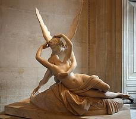
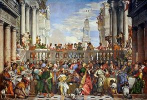
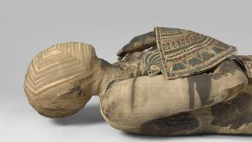

# Lourve in 3 Hours

### Denon 403
1. [Dying Slave](https://en.wikipedia.org/wiki/Dying_Slave)
 
2. [Rebellious Slave](https://en.wikipedia.org/wiki/Rebellious_Slave)
 
3. [Psyche Revived by Cupids Kiss](https://en.wikipedia.org/wiki/Psyche_Revived_by_Cupid%27s_Kiss)
 

### Denon 700
4. [Raft of Medusa](https://en.wikipedia.org/wiki/The_Raft_of_the_Medusa)
 

### Denon 702
5. [Coronation of Emporer & Empres Napoleon](https://en.wikipedia.org/wiki/The_Coronation_of_Napoleon)
 
6. [Intervention of the Sabine Women](https://en.wikipedia.org/wiki/The_Intervention_of_the_Sabine_Women)
 

### Denon 703
7. [Winged Victory of Samothrace](https://en.wikipedia.org/wiki/Winged_Victory_of_Samothrace)
 
8. [Liberty Leading The People](https://en.wikipedia.org/wiki/Liberty_Leading_the_People)
 

### Denon 705
9. [Galerie d'Apollon & Apollo Slays Python](https://en.wikipedia.org/wiki/Galerie_d%27Apollon)
 

### Denon 710
10. [French Crown Jewels](https://en.wikipedia.org/wiki/French_Crown_Jewels)
 

### Denon 711
11. [Mona Lisa](https://en.wikipedia.org/wiki/Mona_Lisa)
 
12. [Wedding at Cana Feast](https://en.wikipedia.org/wiki/Wedding_at_Cana)
 

### Sully 317 - 322
13. [Egyptian Mummy Man](https://www.louvre.fr/en/explore/the-palace/the-guardian-of-egyptian-art)
 

### Sully 336
14. Egyptian Model Boats
 

### Sully 345
15. [Venus de Milo](https://en.wikipedia.org/wiki/Venus_de_Milo)
 

### Sully 346
16. [Venus and The Three Graces](https://en.wikipedia.org/wiki/Venus_and_the_Three_Graces_Presenting_Gifts_to_a_Young_Woman)
 

### Sully 348
17. [Caryatids](https://www.louvre.fr/en/explore/the-palace/at-the-heart-of-the-renaissance-palace)
 
18. [Great Sphinx of Tanis](https://en.wikipedia.org/wiki/Great_Sphinx_of_Tanis)
 

### Sully 602
19. [Portrait of Louis XIV](https://en.wikipedia.org/wiki/Portrait_of_Louis_XIV)
 

